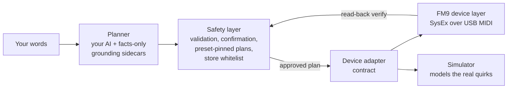

<p align="center">
  
</p>

<p align="center"><strong>OLD SOUL. NEW MACHINE. HUMANS IN COMMAND.</strong></p>

<p align="center"><em>ToneCommand 1.0.0</em></p>

**Talk to your FM9. It builds the tone.** Type a sentence, get a gig-ready,
multi-scene preset on your Fractal FM9 in minutes: the signal chain wired, amps
voiced per scene, cabs chosen, scenes named on the footswitches. You read the
exact list of parameter changes, you confirm, and only then do they land on the
hardware over USB MIDI, verified by reading the unit back. A language model
proposes; it never sends. Nothing reaches your amp until you say go.

## Watch it happen

One sentence, one freshly erased FM9 slot, and six minutes later a complete
eight-scene Judas Priest preset stands on the hardware: signal chain wired
from nothing, amps voiced per era, scenes named on the footswitches, stored
under its own name. Unedited, on a real unit.

<p align="center">
  <a href="https://www.youtube.com/watch?v=jCNAZyyt5o8">
    
  </a>
</p>

Bring your own AI: pick ChatGPT, Gemini, Grok, DeepSeek, Kimi, a subscription
you already pay for, or a model on your own laptop by name in the settings
panel, or use the Claude CLI it finds on its own. ToneCommand translates,
verifies against the real unit, and keeps every write behind your
confirmation ([docs/AI-BACKENDS.md](docs/AI-BACKENDS.md)).

## Features

Everything ToneCommand does, and the words that make it happen. Every prompt
below is a real request you can type.

**Build a whole rig from one sentence**
- A complete multi-scene preset from a single prompt: the signal chain wired,
  an amp voiced per scene role, a cab chosen, drives and effects placed, and
  the scenes named on your footswitches.
  > *"Build a modern metalcore preset in drop C: a big ambient clean, a tight
  > chug rhythm, a lead that sings over the mix, and a heavier breakdown."*
- One tap on **+ Create** drops a blank rig on a free slot (or clears the loaded
  buffer on a full unit) so you always have a clean canvas to build on.
- Open-ended ask? It asks a couple of quick questions first (era, how many
  scenes, how heavy). Specific ask? It just builds.
- The eight-scene grid fills in live as you talk it through, so you catch a gap
  ("nothing in scene 8 yet") before it is built.
- A **tone rulebook** rides on every build: cleans come out loud, leads
  out-saturate the rhythm, no scene ships silent. That balance was dialed in by
  ear on real hardware, so a cold build lands close on the first try.

**Build a tone from a video you do not have time to watch**
- Paste a YouTube link to somebody's rig rundown and get a plan against your own
  FM9 without watching it. When the video has captions (nearly all do, whether
  the creator published them or YouTube auto-generated them) it reads the whole
  transcript and pulls out only the parts that matter in about twenty seconds:
  the intro, the sponsor read, the merch plug and every tangent are thrown out,
  and a two-hour walkthrough becomes a compact tone spec.
  > *"build the rhythm tone from this rig rundown: youtube.com/watch?v=..."*
- No captions? It transcribes the audio locally, on your machine, in a few
  minutes (up to about ninety minutes of runtime; past that it asks you to paste
  the part that matters).
- A forum thread or a pasted chat about someone's tone works the same way: drop
  in a URL or the text of the conversation and it does the same read-and-extract.
- It marks which numbers the source actually stated and which it chose, so a
  guess never wears the source's authority. Ballpark to review and tweak, not a
  clone, and a build from someone else's video never stores to a slot on its own.

**Voice it in plain language**
  > *"a Klon into a JCM800 with a greenback 4x12"*
  > *"tighten the gate for drop C and bump the presence slightly"*
  > *"make scene 1 a dry crunch rhythm and keep the wets in scene 2"*
- Pick a cabinet by name, not by scrolling thousands of IRs: *"put a 4x12 V30 on
  the rhythm channel."*
- Per-block manual controls with -/+ fine-tune on every slider, a graphic EQ
  that looks like one, and 331 amps searchable by the real gear they model.

**Borrow tone from the tones you already own**
- Lift an effect off another preset, aligned scene-for-scene, not just channel
  for channel: *"make my delay like BT Steve Lukather's."*
- Compose a preset from parts of several artists' tones:
  > *"clone BT Marco Sfogli into slot 21, take the gain stage from it, the delay
  > from the Andy Timmons tone, and the reverb from the Periphery one."*
  Every source is read wire-for-wire first, then the new preset is assembled and
  stored once. A better path to a pro tone than guessing parameters from scratch.
- Reorder blocks into the right signal-chain order (drive before the amp, delay
  before reverb), the path proven intact.

**Two expression pedals, by name**
  > *"put global volume on Pedal 1 and wah on Pedal 2"*
  > *"delay mix on Pedal 2 so I can swell into the chorus"*
- Bind either onboard pedal to any continuous parameter, and unbind it the same
  way, all by typing.

**Fast, and honest about it**
- A build lays its whole starter chain in one pass instead of splicing blocks in
  one at a time, and verifies a block's parameters in a single read instead of
  one-at-a-time. The slow, fragile part is gone.
- A **health scan** after every build flags a dead or duplicated scene the
  moment it lands. **Undo** and **A/B** the FM9 itself does not have.
- Install artist presets and cabs from Fractal's Gift of Tone.

**Never sends behind your back**
- Read-back verification on every write, and a signal-path check so a preset is
  never silently dead.
- A "what will change" blast-radius preview before anything is sent, including
  every other scene a channel-level change would move.
- **Gig lock:** mid-set, only scene changes reach the amp.
- Store only to slots you have marked disposable, and only after you confirm.
- **Bring your own AI:** ChatGPT, Gemini, Grok, DeepSeek, Kimi, a subscription
  you already pay for, a model on your own laptop, or the Claude CLI it finds on
  its own.

## Humans in command

That is not a slogan. It is the constraint every other decision here bends to.

A language model proposes. It never sends. There is no autonomous mode, no
"just do it" flag, and no path from a sentence to your hardware that does not
pass through a human reading the exact list of parameter changes first.

The tool refuses more than it does: it refuses to guess a value it cannot
ground, to name gear it has not verified, to claim a pedal sweep works when
only your foot can prove it, and to store to any preset slot you have not
explicitly marked disposable. And before anything is sent, it shows the blast
radius: FM9 parameters live on the channel, not the scene, so every other
scene a change would quietly move lights up amber and says WILL CHANGE, while
there is still time to not do it.

Every verification in this project ends the same way:

**ears: pending, always.**

A machine reading a wire can prove the signal is alive, the levels are sane
and the write landed. It cannot tell you the tone is good. That judgement was
never ours to take, and nothing here will pretend otherwise.

## What you can say

Every line here is a real request the planner turns into concrete, verified
parameter changes, shown to you before anything is sent.

**Build a rig**
- "build a modern metalcore rig in drop C: big ambient clean, tight chug
  rhythm, a lead that sings over the mix, and a heavier breakdown"
- "an 80s hard-rock tribute: big loud chorus cleans, a boosted JCM800 crunch,
  and a soaring lead"
- "give me a Van Halen Balance era tone with the flanger on the expression pedal"

**Voice and tweak**
- "a Klon into a JCM800 with a greenback 4x12"
- "tighten the gate for drop C and bump the presence slightly"
- "make scene 1 a dry crunch rhythm and keep the wets in scene 2"
- "put a 4x12 Recto V30 on the rhythm channel"

**Build from a video or a conversation**
- "build the lead tone from this rig rundown: https://youtube.com/watch?v=..."
- "here is a forum thread about a worship rig, build me scene 1 from it: <url>"
- paste a whole chat about someone's tone and say "make this on my FM9"

**Borrow from artists you own**
- "take the gain stage from BT Marco Sfogli and the delay from the Andy Timmons
  tone"
- "make my delay like BT Steve Lukather's, matched per scene"
- "clone the Periphery Misha preset into slot 22, but pull the reverb from the
  Majesty one"

**Put it under your feet**
- "put global volume on Pedal 1 and wah on Pedal 2"
- "delay and reverb mix on Pedal 2 so I can swell into the chorus"
- "add a subtle octave-down layer like a POG under the lead"

Requests that need facts the project cannot verify get an honest refusal
instead of an invented answer.

## The interface


Everything above is live from a connected FM9; nothing on this page is a
mock-up. The full tour is in [docs/INTERFACE.md](docs/INTERFACE.md). The
short version:

- **The routing grid is your actual routing grid**, cables and all, with the
  live path lit. Click a block to bypass it, click its letter to change
  channel.
- **Audition amps and cabs by typing**, not by turning a knob through 1024
  entries. 331 amps and 2,237 cabs, searchable by what the gear really is.
- **A graphic EQ that looks like one**: faders standing up, seven starting
  curves, one click back to flat.
- **Honest panels**: bypassed blocks are badged, pedal-driven parameters name
  what drives them, and "verified" is never said about a change you cannot
  hear.
- **Blast radius before every send**, a **health scan** that finds dead and
  duplicated scenes, **undo and A/B** the FM9 itself does not have, and
  **saving with the safety catch on**: only to slots you listed, never by
  surprise.

## How it works



The planner never touches the wire. It emits a plan in a closed action
vocabulary; the safety layer validates every action against grounded catalogs
(all 331 amps, 86 drives and 2,235 cab IRs mapped to the real gear they
capture, citations and all), pins the plan to the preset it was computed for,
and requires your confirmation. Only then does the device layer transmit, and
every write is verified by reading the unit back. The simulator sits behind
the same adapter contract, so the whole test suite runs without an FM9
attached ([ARCHITECTURE.md](ARCHITECTURE.md)).

Building it meant decoding parts of the FM9 editor protocol nobody had
written down. Those findings are free to any Fractal tool builder in
[docs/PROTOCOL-CONTRIBUTIONS.md](docs/PROTOCOL-CONTRIBUTIONS.md), and the
community work this stands on is credited in
[docs/CREDITS.md](docs/CREDITS.md).

## Safety

**Rule zero: this tool can never brick a device.** It touches only user data,
every operation is recoverable by a power cycle and preset reselect, and the
transport layer refuses to send any message type outside its decoded,
verified surface: firmware and bootloader operations are structurally
unreachable, on every device, forever.

- **Edit-buffer by default.** Changes go where front-panel knob turns go;
  re-selecting the preset discards everything.
- **Confirm before send**, and plans are pinned to the preset they were
  computed against.
- **Store is disabled until YOU enable it**, via
  `TONECOMMAND_STORE_SLOTS=133-148` (wire numbers; the editor shows 134-149).
  Nobody but you knows what lives in your banks, so there is no default.
- **Never touches firmware,** system settings, or global setup.
- **Back up first anyway.** Run a full Fractal-Bot backup before using any
  third-party MIDI tool, this one included.

## Quick start

Tested on macOS with Python 3.12, FM9 firmware 11.00 and 12.00
(Windows steps are in [docs/SETUP.md](docs/SETUP.md), untested but
expected to work):

```bash
git clone https://github.com/monzta1/ToneCommand.git
cd ToneCommand
python3 -m venv .venv
.venv/bin/pip install -e .
.venv/bin/tonecommand
# open http://127.0.0.1:8909 with the FM9 connected and powered on
```

A signed-in Claude Code CLI is found on its own; any other AI is a chip in
the gear menu ([docs/AI-BACKENDS.md](docs/AI-BACKENDS.md)). To build tones
from YouTube videos, add `pip install -e ".[video]"` and
`brew install ffmpeg` (a system dependency; pip cannot install it); details,
testing and FM9-Edit coexistence notes are in [docs/SETUP.md](docs/SETUP.md).

## Documentation

| | |
|---|---|
| [docs/SETUP.md](docs/SETUP.md) | Install, video extras, testing, compatibility matrix |
| [docs/AI-BACKENDS.md](docs/AI-BACKENDS.md) | ChatGPT, Gemini, Grok, DeepSeek, Kimi, subscriptions, local models |
| [docs/INTERFACE.md](docs/INTERFACE.md) | Every panel, with screenshots |
| [ARCHITECTURE.md](ARCHITECTURE.md) | The adapter contract and the safety layer |
| [docs/PROTOCOL.md](docs/PROTOCOL.md) | The living protocol record, evidence per claim |
| [docs/PROTOCOL-CONTRIBUTIONS.md](docs/PROTOCOL-CONTRIBUTIONS.md) | Original decodes offered back to the community |
| [docs/CREDITS.md](docs/CREDITS.md) | Prior work and contributors |
| [CHANGELOG.md](CHANGELOG.md) | Every release, cause alongside fix |

## Community

ToneCommand has a Slack:
**[join here](https://join.slack.com/t/tonecommand/shared_invite/zt-47oosli5y-GMHa93bbD4Qf76X4s1Crfg)**.
Protocol decodes land in #protocol-decodes with their evidence, the
HeadRush port lives in #headrush, and #show-and-tell is for what your
rig did on stage.

## Support

ToneCommand is free and always will be. If it saved you an evening of
preset fiddling, you can [buy the maintainer a coffee](https://buymeacoffee.com/shieldbearer)
under his stage name, Shieldbearer. Or wear the thing: the emblem is on a
[tee](https://shop.shieldbearerusa.com/products/tonecommand-emblem-tee) and a
[performance jersey](https://shop.shieldbearerusa.com/products/tonecommand-performance-jersey),
both carrying the line at the top of this page, which was written for the
shirt before it described the software.

## Disclaimer and license

Not affiliated with or endorsed by Fractal Audio Systems. Uses a
reverse-engineered protocol; may break with firmware updates. Back up your
presets. Use at your own risk.

Apache License 2.0 for this project's code. Vendored and derived content
carries its own upstream copyrights; see
[THIRD_PARTY_NOTICES.md](THIRD_PARTY_NOTICES.md).
