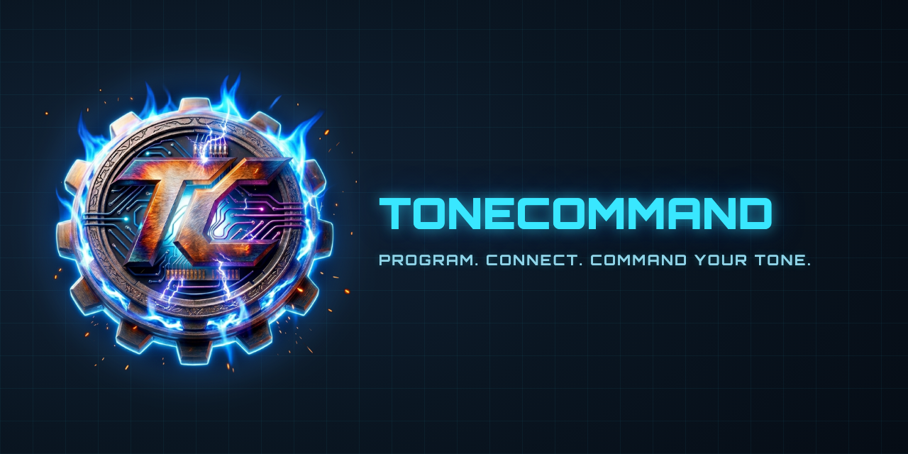
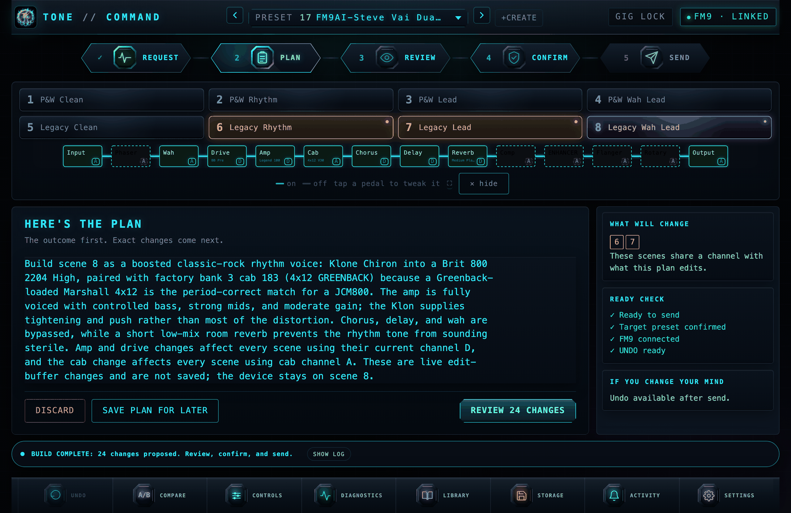
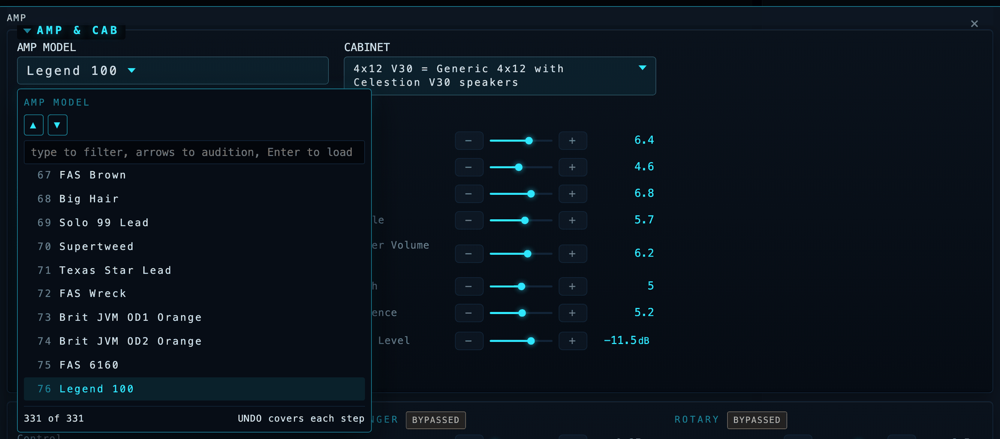
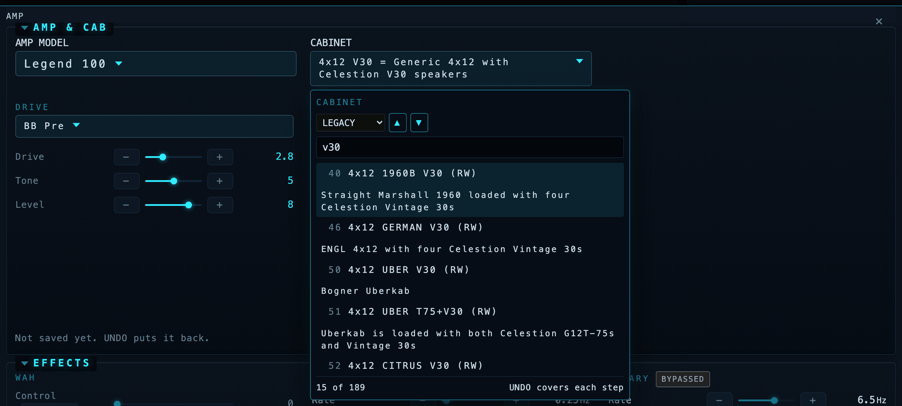
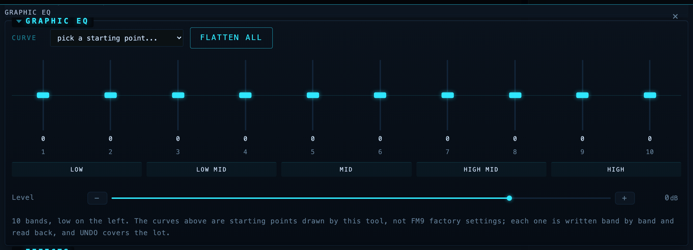
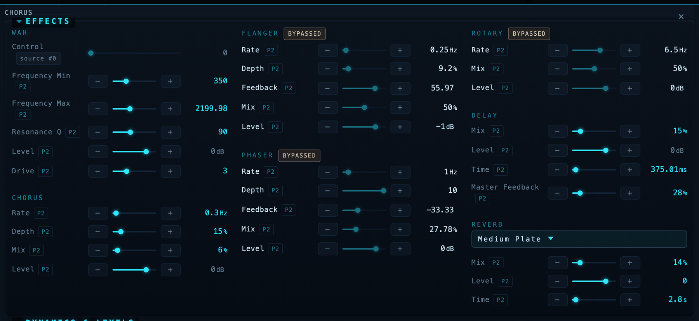
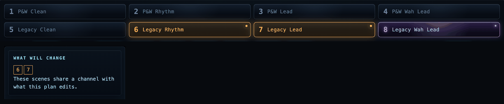
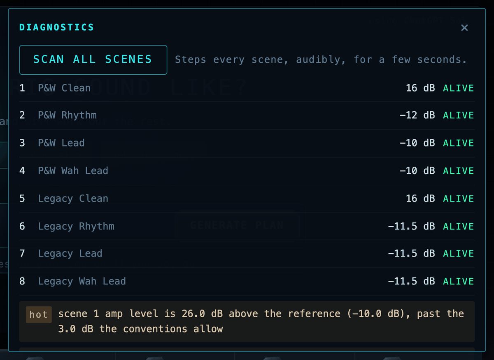

<p align="center">
  
</p>

<p align="center"><strong>OLD SOUL. NEW MACHINE. HUMANS IN COMMAND.</strong></p>

Natural-language tone control for the Fractal FM9: type "give me a Van Halen
Balance era tone with the flanger on the expression pedal", review the exact
parameter changes it proposes, confirm, and they land on the hardware over
USB MIDI with read-back verification.

## Humans in command

That is not a slogan. It is the constraint every other decision here bends to.

A language model proposes. It never sends. There is no autonomous mode, no
"just do it" flag, and no path from a sentence to your hardware that does not
pass through a human reading the exact list of parameter changes first.

The tool refuses more than it does.

It refuses to guess a value it cannot ground, and says so, rather than
inventing a plausible number. It refuses to name a model it has not verified,
so an amp you have never heard of stays an ordinal rather than becoming a
confident lie. It refuses to claim an expression pedal sweep works, because a
dead binding reads identically to a live one over MIDI and the only instrument
that can tell them apart is your foot. It refuses to store to any preset slot
you have not explicitly marked disposable, and names what is in one before it
overwrites it.

And before anything is sent, it shows you the blast radius. FM9 parameters
live on the channel, not the scene, so nudging a mid in scene 1 quietly moves
every other scene sharing that channel. That is how a working preset gets
wrecked by somebody being helpful. Every scene that would move lights up amber
and says WILL CHANGE, while there is still time to not do it.

It ran that check on its author's own rig and found three scenes in one preset
that were the same sound under three different names. One was called PITCH and
had no pitch block in it. That preset had been gigged.

Every verification in this project ends the same way:

**ears: pending, always.**

A machine reading a wire can prove the signal is alive, the levels are sane
and the write landed. It cannot tell you the tone is good. That judgement was
never ours to take, and nothing here will pretend otherwise.

The old soul is the player. The new machine does the arithmetic.



*Everything above is live from a connected FM9. The cyan path is the signal
actually reaching the output; the dashed blocks are bypassed but still passing
through. Nothing on this page is a mock-up.*

## What you can say

Everything below is a real request the planner resolves into concrete,
verified parameter changes (block, channel, ordinal, wire value), shown to
you before anything is sent:

- "give me a Van Halen Balance era tone with the flanger on the expression pedal"
- "a Klon into a JCM800 with a greenback 4x12"
- "tighten the gate for drop C and bump the presence slightly"
- "make scene 1 a dry crunch rhythm and keep the wets in scene 2"
- "put the delay and reverb mix on pedal 2 so I can swell into the chorus"
- "add a subtle octave-down layer like a POG under the lead"

Requests that need facts the project cannot verify get an honest refusal
instead of an invented answer (see Grounding Data below).

## The interface

The rule this UI is built to: **if you have to switch to FM9-Edit in the middle
of a session, we have already lost.** Every panel is a control surface, not a
readout.

### The signal chain is your actual routing grid

Rows, columns and cables as the unit has them, with the live path lit and
anything the signal never reaches left grey. Click a block to bypass or engage
it; click its channel letter to cycle A through D. The traversal is the same
one the path audit uses, so what is drawn is what was proven, not a second
guess at it.

### Audition amps and cabs faster than the unit can



On the FM9, changing a cabinet means turning a knob through 1024 entries one at
a time, because there is nowhere to type. Here you type two letters and step
the shortlist with the arrow keys while you keep playing. 331 amps and 2,237
cabs, searchable by name **and** by what the cab actually is, because
"Vibrolux" lives in the description.



Every step loads on the unit and is covered by UNDO, because an audition you
cannot back out of is a trap rather than a feature.

### A graphic EQ drawn the way one looks



Ten horizontal rows of numbers is a spreadsheet of an EQ, not an EQ. The point
of the control is that the curve is a **shape** you read at a glance, and every
musician already knows how to read it. So: faders standing up, zero a line
across the middle, the whole width of its own panel.

Seven starting curves and one click back to flat. A curve is written as a
single batch, so it takes one undo snapshot and cannot land half applied.
Those curves are ones this project drew, not FM9 factory settings, and the
panel says so.

The bands are **numbered**, not labelled with frequencies. `GEQ_TYPE` is an
eighteen-value enum selecting the band layout and the catalogue carries one
label per parameter, so those frequencies cannot all be right for the EQ you
have loaded, and they are neither ascending nor unique. The strip underneath
names the region instead, which is true of every graphic EQ ever built.

### Why did that change do nothing?



The most misleading thing a tone tool can say is "verified" about a change you
cannot hear. There are two ways to get one, and this shows both.

**A bypassed block** is not in the signal, so a write to it lands, verifies by
read-back, and changes nothing. The signal chain always drew those dashed; the
parameter panels did not know at all, and gave a switched-off block a full set
of live-looking sliders. Now they carry a badge, and the badge is also the fix:
one click engages the block.

**A modifier-driven parameter** is worse, because the FM9 sources its value
from a pedal or an envelope and the number stored on the block stops mattering.
Those rows name what drives them and are not draggable. This is also the only
honest answer to "is that a pedal wah or an auto wah": the FM9 has no auto-wah
type, so a wah is whatever its sweep is attached to. Read the attachment and
the question answers itself.

Hover any continuous row for **P2** to put it under Pedal 2, several at once if
you like, one modifier slot each. The binding clones its curve off a slot the
device itself built rather than inventing one, and it never claims the sweep
works: live modulation is invisible to every read the protocol offers, and a
dead binding reads byte-identical to a live one. Check it with your foot.

Pedal 1 is your global volume and is never referenced, in either direction.

### Blast radius



FM9 parameters live on the **channel**, not on the scene. Turning up the mid in
scene 1 moves every other scene sharing that channel, which is the single
easiest way to wreck a working preset without noticing.

So before anything is sent, the tool shows you the blast radius: every scene
the pending plan would also move lights up and says WILL CHANGE, at the same
visual weight as the scene you are standing in. It goes out the moment the
plan does.

### It can tell you whether a preset is actually correct



The question no other FM9 tool answers. FM9-Edit edits presets; it does not
reason about them, so it will happily let you save one whose scene 4 makes no
sound. A scan walks every named scene and reports whether a live signal path
exists, names the hop that broke it when one does not, lists amp level and
volume gain side by side, and flags scenes that are byte-identical duplicates
of each other.

That last check found a real one: preset 151 had **three** scenes that were the
same sound under different names, and three separate audits had passed it,
because a duplicate is not broken by any rule anyone had written down.

The ladder ends honestly. Every check is a machine reading a wire, so the
bottom rung always reads **ears: pending**.

### Saving, with the safety catch on

Everything else in this app is edit buffer only and reversible. Saving is not,
so it gets its own panel and its own rules: it offers only the slots you listed
in `TONECOMMAND_STORE_SLOTS` and never a free-text number, shows both the wire
number and the FM9-Edit number for each, tells you what the slot currently
holds, and asks before it overwrites. It also says plainly that undo will not
help you here, because undo restores the edit buffer and cannot un-write a
preset slot.

It aims at the preset you are looking at, because "save" means "save this
preset" to anyone who has ever used an editor. When the loaded preset is not
one you marked disposable, the panel tells you so instead of quietly pointing
somewhere else.

Storing is disabled until you designate disposable slots, because nobody but
you knows what lives in your banks.

### Undo and A/B, because the FM9 has neither

A snapshot is a silent read of the whole edit buffer, about a quarter of a
second, taken automatically before every change. So UNDO is always armed rather
than something you had to remember to turn on, and a restore writes only the
handful of values that actually differ. Recalling A captures B first, so A/B is
a round trip and not a one-way door.

## Why this is different

**It knows what the models actually are.** Fractal names like "Brit 800
2204 High" or "1x12 Bludo 906 B" resolve to the real gear they capture:
all 331 amps, all 86 drives, and 2,235 cab IRs are mapped to their
real-world counterparts, every entry cited to community sources, facts
only. Ask for "a Klon into a JCM800 with a greenback 4x12" and it knows
exactly which ordinals you mean. When it doesn't know, it says so.
Nothing is ever invented.

**It tells the truth about hardware.** Every write is verified by
reading the unit back. Presets are stored only to slots you whitelist,
only on explicit confirmation. The bundled simulator models the FM9's
real quirks, including async writes and the operations no hardware
session has verified yet, which it reports by name instead of silently
simulating.

**It was built on a real rig, for real gigs.** This codebase preps
actual setlists: worship sets on Sunday, metal shows with Shieldbearer
whenever the stage calls. Per-song presets voiced from the artists' own
published tone breakdowns, 80s-metal rhythm channels next to ambient
drone scenes, an expression pedal riding every delay. The tooling
exists because the gigs do, and it has to cover everything from
edge-of-breakup cleans to high-gain chug in the same rig.

**It gives back.** Building it meant decoding parts of the FM9 editor
protocol nobody had written down: grid cable encodings, negative
parameter wire format, which reads lie and which don't. It's all
documented below in Protocol Contributions, free for any Fractal tool
builder. The first outside contributor has already mapped the entire cab
catalog and is porting the concept to HeadRush.

## How it works


The planner never touches the wire. It emits a plan in a closed action
vocabulary; the safety layer validates every action against the grounded
catalogs, pins the plan to the preset it was computed for, and requires
your confirmation in the UI. Only then does the device layer transmit,
and every write is verified by reading the unit back. The simulator sits
behind the same adapter contract as the hardware, so the entire test
suite runs without an FM9 attached ([ARCHITECTURE.md](ARCHITECTURE.md)
has the full contract).

The strategy is deliberately FM9-first: make this the safest, most
reliable natural-language control surface for one device before adding
others. The adapter contract exists so future devices inherit the safety
layer instead of reimplementing it, but depth comes before breadth.

## Engineering principles

This project runs on a few non-negotiable rules, and the repository is
the evidence they're followed:

**Claims are verified or labeled.** Every protocol behavior in
[docs/PROTOCOL.md](docs/PROTOCOL.md) was proven by write-plus-readback
on real hardware or is explicitly marked UNDECODED. When we got
something wrong, the correction is public and marked SUPERSEDED - the
ledger keeps our mistakes on the record alongside the fixes, because a
reference you can't audit is not a reference.

**The safety layer is architecture, not policy.** Validation before
send, explicit confirmation, store whitelists, read-back verification,
and simulator honesty live above the device layer
([ARCHITECTURE.md](ARCHITECTURE.md)), so no device port, contributor, or
future feature can accidentally weaken them. New devices inherit safety;
they don't reimplement it.

**Failures become infrastructure.** Every hardware bug this project hit
was converted into a permanent defense: silent write failures became
read-back verification, a severed-cable incident became self-repairing
block insertion, a silently ignored parameter write became a device-layer
fix with a regression test, and the simulator now reproduces each quirk
so the class of bug can't ship twice. The [CHANGELOG](CHANGELOG.md)
records cause alongside fix.

**Contributions are spec-gated and reviewed.** Community PRs land after
assessment-first workflows, CI, and review with file-level findings -
including the one where a contributor proved the maintainers wrong and
the codebase changed to match the hardware. Data contributions carry
citations and drift guards; invented facts are rejected regardless of
how plausible they look.

## Credits & Prior Work

This project would not exist without the Fractal community's protocol work.
The heavy lifting of reverse-engineering the FM9-Edit editor protocol was
done by others; this project builds on it, verifies it against hardware,
and contributes corrections back (see Protocol Contributions below).

- **[mcp-midi-control](https://github.com/TheAndrewStaker/mcp-midi-control)**
  by **Stephen Staker** (TheAndrewStaker), Apache-2.0. The foundation. Its
  `SYSEX-MAP.md` is the best public documentation of the gen-3 Fractal
  editor protocol, byte-verified from hardware captures and binary mining.
  This project's `fm9/protocol.py` is a Python port of its TypeScript
  codec, and `config/fm9_catalog.json` is its FM9 parameter catalog,
  vendored verbatim. Roster data therein derives in part from
  **fractal-syx-codec** by Andrew Mercurio (Apache-2.0), and the grid-read
  cell layout was originally contributed by the **ai-tone-assistant**
  project (MIT).
- **[forgefx-midi](https://github.com/sKuhLight/forgefx-midi)** and
  **[ForgeFX](https://github.com/sKuhLight/ForgeFX)** by **sKuhLight**
  (Apache-2.0 and MIT respectively). Source of the FM9 modifier model:
  slot addressing, the binary-mined field map, and the bind sequence that
  makes expression-pedal assignments possible over MIDI. Re-implemented in
  Python here; ForgeFX was consulted, no code copied.
- **Fractal Audio Systems** publishes the official third-party MIDI spec
  ("Axe-Fx III MIDI for Third-Party Devices", Rev 1.4) that covers the
  documented command set: scenes, bypass, channels, names, tempo, and the
  effect ID table.

### Contributors

Everything above is prior art this project builds on. These people built the
project itself.

- **[@bschmalz81401](https://github.com/bschmalz81401)** (Brian Schmalz).
  Thirteen merged pull requests and the largest single body of work here after
  the maintainer's. The "bring your own AI" backends, so the planner runs on
  Grok, any OpenAI-compatible endpoint, or a model on your own laptop.
  Building a preset from scratch into an empty slot. Selective cable removal,
  decoded and hardware verified, and the block splice it makes possible, which
  is what lets a block go into a chain with no room in it. The cab roster
  mapped to the real cabinets. He tests his own changes against real hardware,
  files the bugs he finds in his own pull requests out loud, and on one
  occasion closed a PR of his own in favour of a fix he thought was worse than
  it was, then caught the maintainer merging the wrong one anyway. That last
  part is rarer than it sounds and it is why this project's simulator is
  honest about the hardware.
- **[@Triumph1701](https://github.com/Triumph1701)**. Designed the planner
  backend fall-through contract (#7): how the app degrades cleanly across
  wildly different AI backends, which of them can constrain output and which
  cannot, and why validation stays load-bearing regardless. Implemented as
  specified.

Full license reproductions and file-level provenance:
[THIRD_PARTY_NOTICES.md](THIRD_PARTY_NOTICES.md).

## Safety

**Rule zero: this tool can never brick a device.** It touches only
user data, every operation is recoverable by a power cycle and preset
reselect, and the transport layer refuses to send any message type
outside its decoded, verified surface - firmware and bootloader
operations are structurally unreachable, on every device, forever.

Designed so it cannot hurt a rig you care about:

- **Edit-buffer by default.** All changes go to the FM9's volatile working
  buffer, the same place front-panel knob turns go. Re-selecting the preset
  discards everything.
- **Confirm before send.** The natural-language layer only ever proposes a
  plan; nothing is transmitted until you approve it in the UI, and plans
  are pinned to the preset they were computed against (if you switch
  presets on the front panel, the stale plan is refused).
- **Preset numbers are 0-based here.** The MIDI wire numbers the 512 slots
  0-511, while FM9-Edit and the front panel number them 1-512, so wire 386
  is the preset your editor calls 387. Tools print both. `TONECOMMAND_STORE_SLOTS`
  takes WIRE numbers, so `133-148` designates what the editor shows as 134-149.
- **Store is disabled until YOU enable it.** Persisting to flash refuses
  every slot until you designate disposable ones on your own unit via
  `TONECOMMAND_STORE_SLOTS=133-148` (env var or `.env` line; ranges and
  comma lists accepted). Nobody but you knows what lives in your banks, so
  there is no default. Enforced at the lowest code layer; everything
  outside your configured slots is untouchable.
- **Never touches firmware,** system settings, or global setup.
- **Back up first anyway.** Run a full Fractal-Bot backup before using any
  third-party MIDI tool, this one included.

## Protocol Contributions

Original findings from this project's hardware verification (FM9 firmware
11.00 and 12.00), offered back to the community projects above:

1. **FM9 grid insert requires a cell-select first.** The insert frame
   (fn 0x01 sub 0x32) alone lands the block on the device's internal
   cursor, not the frame's target cell. Sending the cell-select
   (sub 0x30, cell index as a raw uint32 in 5 septets) immediately before
   makes placement honor the target. Upstream documents the FM9 as not
   needing the select; that conclusion came from status-dump verification,
   which can confirm a block exists but not where it landed. Grid-read
   verification exposes the difference.
2. **Grid-read effect IDs alias mod 128.** The sub 0x2E grid bitstream
   stores the block id in 8 bits as (id << 1), so effect ids >= 128 wrap:
   FX Send (182) reads as 54, FX Return (186) reads as 58. Disambiguate
   against the fn 0x13 status dump.
3. **FM9 modifier source ordinal 11 = Pedal 2 (EXP/SW TIP),** confirmed
   physically. Upstream marks the FM9 source enum as uncaptured with an
   explicit warning against assuming the FM3's values; at least around the
   pedal entries, the FM3 ordering holds on the FM9.
4. **Documented dead ends** so nobody re-burns time on them: the sub 09 00
   GET always returns a zeroed value field on fw 11.00 (use the fn 0x1F
   bulk read instead); the sub 0x1F display-name query returns "NONE" for
   modifier source enums, and for the amp block it returns the roster's
   FIRST entry regardless of the actual amp type - before and after
   writes, through seconds of settle (proven on fw 12.00 by
   @bschmalz81401, reproduced on fw 11.00; this project's earlier "fresh
   for amp" claim was wrong). Never verify a type through it; read the
   wire value and map through the roster. Live modulation (a moving
   pedal) is invisible to every known read, so pedal bindings must be
   verified physically.
5. **Cable drawing hardware-validated.** The community's 6-row cable
   encoding formula (fn 0x01 sub 0x35), previously byte-derived from
   captures but unverified as a live write, draws correct cables on FM9
   firmware 11.00: all masks confirmed by grid read-back. Also verified:
   placing an already-placed block at a new cell is ignored (a "move" is
   clear-then-insert, and clearing a cell destroys its cables).
6. **Shunt-replacement insertion.** Placing a block onto an existing shunt
   cell inherits the shunt's cables, which makes it possible to add effects
   into a preset's signal chain without touching the only partially decoded
   cable-drawing encoding at all.
7. **Same-row cable draws on row 2 use their own encoding.** The general
   6-row formula silently draws nothing for a row-2-to-row-2 connection.
   Probed on hardware (fw 11.00): odd source columns need dest_sign 0 with
   b23 3, even columns dest_sign 1 with b23 1. The general formula's
   prediction for those byte values collides with a different geometry, so
   the same bytes mean different things than it assumes. Row 5 same-row
   draws match the general formula. Also observed: a 2-row diagonal draw
   does not register at all, and re-sending an identical draw does NOT
   remove the cable (removal is a different, still-unknown message).
8. **Writes are asynchronous; unsettled reads lie plausibly.** A read
   issued immediately after a write returns the pre-write state with no
   error indication. The bundled simulator now models this (an 80ms settle
   window) and additionally tracks "undecoded territory": operations no
   hardware session has verified are reported by name rather than
   silently simulated.
9. **Empty preset slots identify themselves, and leave a ghost.** The FM9
   writes its own marker, `<EMPTY>`, into an unused slot's name field - so
   detecting a free slot needs no heuristic. Clearing a slot overwrites
   only the FIRST 8 BYTES of the 32-byte name field and leaves the rest of
   the previous name in flash, so name fields must be cut at the first NUL
   rather than right-stripped. Right-stripping yields the marker glued to
   the tail of a preset that no longer exists (`'<EMPTY>\0 Phat Time'`).
   Verified across all 512 slots on fw 12.00.
10. **fn 0x0D reads any slot by number, out of flash, without loading it.**
    Passing a preset number instead of the "current" sentinel answers from
    storage and leaves the loaded preset and the edit buffer untouched, with
    the requested number echoed back. A 512-slot sweep was byte-identical to
    a select-and-read sweep of the same unit and took 4.7s instead of ~4.5
    minutes, with the front panel never moving. Confirmed on fw 11.00 and
    12.00. Out-of-range numbers are ANSWERED rather than refused - preset
    512 returns a blank name field - and a blank is not the `<EMPTY>`
    marker, so unguarded readers call a nonexistent slot occupied.
11. **A preset can be built from nothing.** An empty slot has NO grid cells
    at all and no Input or Output blocks - its status dump carries only the
    ever-present ids 200 and 201 - so there is nothing to splice into and no
    cable to inherit. Placing blocks into that blank grid works, Input and
    Output included, each arriving uncabled. Same-row cable draws on row 3
    then work with the general 6-row formula (previously only rows 4 and 5
    were confirmed; row 2 needs its own encoding, item 7). Verified on
    fw 12.00 by building Input -> amp -> cab -> Output across columns 1-4
    and confirming the result audible by ear.
12. **Cable removal is the draw message with op 0x02.** The routing message
    (sub 0x35) carries an op byte; 0x01 connects and 0x02 disconnects, with
    the identical geometry encoding. Verified on fw 12.00: it clears the
    destination mask, survives repeated remove/redraw cycles, is idempotent
    rather than a toggle, and is SELECTIVE - on a cell fed by two sources it
    clears only the named source bit. Prior belief, ours included, was that
    removal was a different and unknown message.

## Grounding Data

The planner grounds Fractal's model names in the real-world gear they
model, so "give me a Klon into a JCM800 with a greenback 4x12" resolves
to actual ordinals instead of guesses:

| Domain | Coverage | Source |
|---|---|---|
| Amp models | 331 / 331 | Yek's Amp Guide (community PDF, facts only) |
| Drive models | 86 / 86 | Yek's Drive Guide + Fractal wiki Drive block page |
| Cab IRs | 2,235 / 2,237 | Fractal wiki Cab models page (via @bschmalz81401) |
| DynaCabs | 45 / 45 | same |

All sidecars are facts-only (no prose reproduced), carry the Fractal
name they were built against, and fail loudly if a catalog update
renumbers the rosters. Unknowns stay unknown: nothing is invented.

## Compatibility

Verified means proven by write-plus-readback on real hardware in this
project's regression runs; nothing below is assumed.

| Capability | FM9 fw 11.00 | FM9 fw 12.00 | Simulator |
|---|---|---|---|
| Scene, bypass, channel control | Verified | Verified (contributor) | Modeled |
| Parameter set with read-back verify | Verified | Verified (contributor) | Modeled |
| Expression pedal (modifier) binding | Verified | Untested | Modeled |
| Block insert and cable drawing | Verified | Verified | Modeled, incl. known encoding quirks |
| Store to whitelisted slots | Verified | Untested | Modeled |
| Tone library harvest (all 512 slots) | Verified | Untested | Modeled |
| Slot name read by number, no select | Verified | Verified | Modeled |
| Empty-slot detection (`<EMPTY>` marker) | Untested | Verified | Modeled |
| Preset built from scratch in an empty slot | Untested | Verified | Modeled |

Hardware: developed and regression-tested on an FM9 Mk II Turbo. Other
FM9 variants share the model byte and should behave identically, but are
untested. Axe-Fx III and FM3 use different model bytes and are not
supported. Firmware outside 11.x / 12.00 is untested; the editor
protocol is unofficial and firmware-sensitive, and the hardware
regression suite passing is the green light after any update. The
original protocol feasibility findings, with the exact commands and
responses observed, are written up in
[docs/HARDWARE-VALIDATION.md](docs/HARDWARE-VALIDATION.md) - a dated
snapshot from 2026-08-16, kept as a record rather than maintained; the
living protocol record is [docs/PROTOCOL.md](docs/PROTOCOL.md).

## Disclaimer

Not affiliated with or endorsed by Fractal Audio Systems. Uses
reverse-engineered protocol; may break with firmware updates. Back up your
presets. Use at your own risk.

## Install / Setup

Tested on macOS (Apple Silicon) with Python 3.12 and an FM9 connected over
USB, on firmware 11.00 and 12.00.

```bash
git clone https://github.com/monzta1/ToneCommand.git
cd ToneCommand
python3 -m venv .venv
.venv/bin/pip install -e .
```

Dependencies are declared in [pyproject.toml](pyproject.toml); add
`".[dev]"` to also get the test tooling.

### Building from a video (optional)

The "build from a video or description" field takes pasted text and page URLs
with no extra setup. Reading a **YouTube link** needs more, and it is optional
on purpose:

```bash
.venv/bin/pip install -e ".[video]"     # yt-dlp and faster-whisper
brew install ffmpeg                      # or apt install ffmpeg
```

Three sources are tried, cheapest first: the video **description**, which is
where most players put their gear list; the **captions**, free and instant
where they exist; and failing both, the audio is downloaded and **transcribed
locally** with Whisper. Nothing is sent to a transcription service.

`ffmpeg` is a system dependency and pip cannot install it. It is only needed
for that last case. The app tells you at startup which of the three it can do
on your machine rather than failing at the end of a long wait.

Transcription is CPU only and measured on an M-series Mac at about 9.6x
realtime, so an hour of video is roughly six minutes. The `base` model is the
default for that reason; set `TONECOMMAND_WHISPER_MODEL=small` for better
accuracy on gear names at about a third of the speed. Videos longer than 90
minutes are refused rather than transcribed, with a suggestion to paste the
relevant part.

**Long videos are the normal case and are handled by compression, not by
patience.** A source is read into a compact spec before anything is built: a
5,286 word walkthrough became a 282 word brief in 49 seconds, keeping all
twelve of its tone statements and dropping the sponsor read. The expensive
build pass never sees the transcript.

### Two ways to work

The page has two tabs. **DESIGN WITH AI** holds the conversation, the plan it
proposes, recipes and scratch builds. **MANUAL** holds every slider: amp and
cab, graphic EQ, effects, dynamics.

Scenes and the signal chain sit above both, because they are what you are
looking at either way. Undo, save and the log sit below both, because they
cover what either half just did. A plan waiting to be confirmed always brings
the AI tab forward: a proposal you cannot see is one you cannot refuse.

### Talking it through first

A tone is an opinion, and the first sentence somebody types is rarely the one
they mean. "Warmer" from a player chasing a Dumble and "warmer" from one
chasing a Vox are different edits.

Say what you want in the COMMAND box and press **SEND**. It replies, asking
about what you can hear rather than about parameter names, and it knows what is
in your preset, so it names your actual amp and cab rather than talking in the
abstract. Keep going until you agree. When it has enough to go on it shows the
agreed change and offers **BUILD THIS**.

One box, one action. Building is offered once there is something agreed to
build, and not before.

Nothing about safety changes. Conversation produces no actions and has no path
to the hardware; it produces a better sentence, and that sentence goes through
the same planner, the same `validate_action` and the same confirm gate as any
other. If the planner needs to ask something before it can act, its question
now lands in the conversation, where there is a box to answer it.

### Planner backends

Natural-language planning tries, in order of preference:

1. **An OpenAI-compatible endpoint**, if `PLANNER_BASE_URL` is set (see
   below). A configured endpoint wins: choosing one is deliberate, while a
   `claude` binary on `PATH` is an accident of the machine.
2. **The Claude Code CLI**, if installed and signed in (usage bills to your
   existing Claude subscription). The default when nothing is configured -
   a fresh checkout needs no key.
3. **The Claude API**: put `ANTHROPIC_API_KEY=sk-ant-...` in a `.env` file
   at the repo root.

Every plan reports which backend and model answered, and a failed backend
falls through to the next with its reason recorded.

Settings go in the environment or in `.env` at the repo root, the same file
the store whitelist uses:

| Variable | Default | Meaning |
|---|---|---|
| `PLANNER_BACKEND` | none | Pin one of `openai`, `cli`, `grok`, `api` and disable fallthrough. Required to reach the Grok CLI directly. |
| `PLANNER_BASE_URL` | none | OpenAI-compatible endpoint, including `/v1`. Setting it makes that backend first. |
| `PLANNER_MODEL` | `local` | Model for the OpenAI-compatible path. |
| `PLANNER_API_KEY` | none | Only if your endpoint wants one. Often nothing is needed. |
| `PLANNER_MAX_TOKENS` | `8192` | Reply cap on the OpenAI-compatible path. Reasoning models need headroom. |
| `PLANNER_TIMEOUT` | `180` | Seconds allowed per backend attempt. |
| `GROK_CLI_MODEL` | none | Model passed to the `grok` CLI. Unset uses its own default. |

### Using ChatGPT

Open the gear, choose **ChatGPT, or another service you choose**, and click
the **ChatGPT** chip. That fills in the address. Paste a key from
platform.openai.com and save, and the model box fills itself in with one your
key can actually reach, picked from the service's own list. Change it from the
dropdown if you want a different one.

A key is genuinely required on this route, and so is a model: with the box
blank the planner sends `local`, which a hosted service answers with a 404 for
a model nobody asked for.

Note that an OpenAI API key is a separate, pay-per-request account from a
ChatGPT Plus subscription.

### Using the ChatGPT subscription you already pay for

Choose **A subscription you already pay for** and click **SHOW ME HOW**. Each
step has a **DO IT FOR ME** button; the only one you have to do yourself is
signing in to your own ChatGPT account, which opens in your browser. The
terminal command for every step is still there under *or run it yourself*, for
anyone who would rather see what runs on their machine, or who is not on
Homebrew.

It checks your machine after every step and will not advance on your say-so,
so a step that silently failed is caught where it happened rather than at the
next prompt.

It installs [CLIProxyAPI](https://github.com/router-for-me/CLIProxyAPI), a
separate MIT-licensed service (`brew install cliproxyapi`), signs it into your
ChatGPT account over the normal OAuth flow, replaces the placeholder passwords
it ships with, and starts it as a background service. The app never runs any of
that itself: it shows you the command and verifies the result. The password is
derived from your machine and filled into the panel for you.

Proven end to end on a ChatGPT Plus account: a plan came back in 8.5s through
`gpt-5.5` with three valid actions and no validation errors.

Two things worth knowing. OpenAI sells Codex for use through their own
clients, and routing it into another app is not something they bless, so it
could change without notice. And the same setup also covers Gemini, Grok and
Kimi on their own logins.

### Using Grok, Codex, Gemini or a local model

Two routes, and neither ships with this project:

**The Grok CLI directly.** Install xAI's Grok CLI as its own documentation
directs (`curl -fsSL https://x.ai/cli/install.sh | bash` at the time of
writing), sign in, then set `PLANNER_BACKEND=grok`. Its replies are
constrained to the planner's JSON schema, which the Claude CLI path cannot
do. Verified against grok 1.0.5.

**Anything else, through a router.** Install and run
[CLIProxyAPI](https://github.com/router-for-me/CLIProxyAPI) yourself. It is a
separate MIT-licensed service, not bundled here and not a Python dependency.
Log it into whichever upstream you want (Claude Code, Codex, Grok, Gemini,
Kimi all authenticate over their own OAuth), then point this tool at it:

```
PLANNER_BASE_URL=http://127.0.0.1:8317/v1
```

The same setting reaches a local model instead: LM Studio defaults to
`http://127.0.0.1:1234/v1`, Ollama to `http://127.0.0.1:11434/v1`. An API key
is usually unnecessary: an OAuth router authenticates upstream on its own.

Two honest caveats. Only the Claude API and Grok CLI paths *constrain* output
to the plan schema; the Claude CLI and OpenAI-compatible paths ask for JSON and
are believed, which is why validation against the device reference is
load-bearing rather than a safety net. And a weaker model proposes worse tones.
It cannot hurt the rig, since nothing transmits without your confirmation, but
it wastes your time.

Run:

```bash
.venv/bin/tonecommand
# open http://127.0.0.1:8909 with the FM9 connected and powered on
```

Testing is two-tier:

```bash
.venv/bin/pytest tests/                    # simulator + validation suite, no hardware needed (runs in CI on every push)
.venv/bin/python hardware_regression.py    # 13-check on-hardware regression; run after any firmware update
.venv/bin/python build_133.py              # example: scripted full preset build (stores to wire slot 133 = FM9-Edit 134)
```

Notes:
- FM9-Edit can be open at the same time, but only one of you should be
  making edits. This note used to say FM9-Edit resets the edit buffer when
  it connects; that was tested and it does not. With an unsaved chain
  sitting in the buffer, FM9-Edit 1.03.21 connected to an FM9 on fw 12.00
  and the edits survived intact, and twelve rounds of reads here stayed
  correct while the editor polled the shared CoreMIDI port at ~60
  messages/second. What actually discards buffer edits is LOADING a
  preset - from FM9-Edit, the front panel, or this tool - which is the
  ordinary mechanism rather than an FM9-Edit quirk. Two clients writing
  the same parameters will still fight, and concurrent writes are untested,
  so keep editing to one side at a time. Older FM9-Edit versions and
  fw 11.00 are untested here. Stored presets are safe either way and remain
  fully viewable and editable in FM9-Edit.
- Firmware and hardware coverage is spelled out in the Compatibility
  section above; run `hardware_regression.py` after any firmware update
  before trusting writes.

## Community

ToneCommand has a Slack:
**[join here](https://join.slack.com/t/tonecommand/shared_invite/zt-47oosli5y-GMHa93bbD4Qf76X4s1Crfg)**.
Protocol decodes land in #protocol-decodes with their evidence, the
HeadRush port lives in #headrush, and #show-and-tell is for what your
rig did on stage. If you're building on the protocol findings, porting
to another device, or just got a tone you're proud of, come say hi.

## Support

ToneCommand is free and always will be. If it saved you an evening of
preset fiddling, you can [buy the maintainer a coffee](https://buymeacoffee.com/shieldbearer)
under his stage name, Shieldbearer - the same rig this tool preps for
real gigs.

Or wear the thing. The emblem is on a
[tee](https://shop.shieldbearerusa.com/products/tonecommand-emblem-tee) and a
[performance jersey](https://shop.shieldbearerusa.com/products/tonecommand-performance-jersey),
both carrying the line at the top of this page, which was written for the
shirt before it described the software.

## License

Apache License 2.0 for this project's code. Vendored and derived content
carries its own upstream copyrights; see
[THIRD_PARTY_NOTICES.md](THIRD_PARTY_NOTICES.md).
